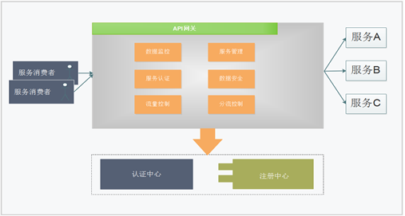
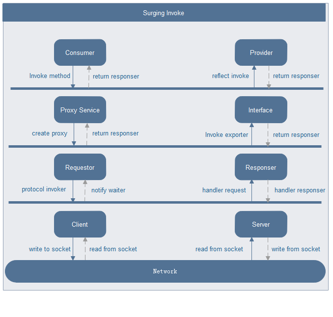

# 牢记微服务的工作原理
It's programming of the modern era, where we are expected to follow all SOLID principles. It's object-oriented programming (OOP). It is the best way is to expose the functionality to other or external components in a way so that any other programming language will be able to use the functionality without adhering to any specific user interfaces, that is, services (web services, APIs, rest services, and so on).The whole system works as per a type of collaboration that is not interconnected or interdependent. Every component is liable for its own responsibilities. In other words, components are responsible for only one functionality. It segregates code with a separation concept, and segregated code is reusable.

+ ## 单体应用架构
    当网站流量很小时，只需要将所有功能部署在一起，以减少部署节点和成本
    单体架构业务流程往往在同一个进程内部完成处理，不需要进行分布式协作，它的工作原理如下：
    

+ ## 垂直应用结构
    当访问量逐渐增大，单体架构压力越来越大，将架构拆成互不相干的若干应用以提升效率，此时采用MVC、webAPI进行调用
+ ## 分布式微服务架构
    当垂直应用越来越多，应用之间交互不可避免，可以将各个独立的业务模块，部署成独立的微服务，逐渐形成稳定的服务中心。而Surging 微服务采用分布式集群部署方式，服务的消费者和提供者通常运行在不同的进程中，进程之间通信采用RPC方式调用，它的工作原理如下：
    
    