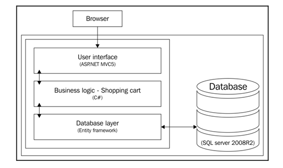
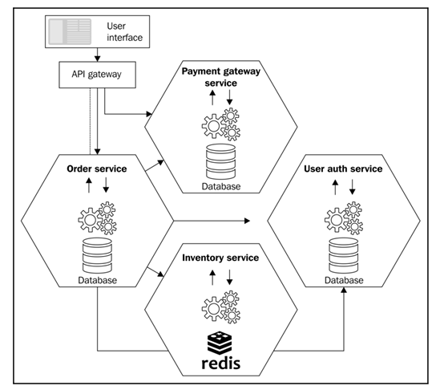

# 微服务投入生产使用前的热身
当你看到这里的时候，想必你的技术能力应该不错，至少应该对多层架构非常熟悉，如果不熟悉，那么你也没有往下看的必要了。
现在而言大多数企业都在使用多层架构，架构图如下：
    

如果真的要投入生产使用微服务架构，你一定会在心里想，这个架构将要做怎样的修改呢？
结合上面的概念，请你时刻牢记一句话，也就是微服务的精髓——【微服务是一种以多个小服务来构成应用的架构风格，是SOA的升级版】，那么答案就很清晰：
    

怎么样，和你心里的预期是否吻合呢？此时此刻，你是不是想说，哎呀我擦，微服务就这样？
千真万确，微服务就是这样。你是不是还想问？
+ 使用微服务架构后，数据库的事务处理还怎么用？
+ 复杂的业务作为服务怎么实现？
+ 甚至你足够聪明的话，应该会想到API gateway和服务器以及负载均衡怎么处理啊？
+ 数据库库完全拆分开了，那么统计报表和表之间的关系处理怎么写？

那么首先恭喜你，你已经掌握微服务的精髓了，然后这些问题的答案先不告诉你。。。
至于原因嘛，就是这些疑问和微服务没有啥关系。事实上具体的来将，你应该使用过WebService（也就是SOA架构），其内部的服务实现跟你用面向过程和面向对象的代码设计方式没有任何关系，和内部的数据更没有任何关系，架构只解决架构层面的问题，在架构设计下面还有功能模块设计，而这些地方才是设计模式真正发挥作用的地方，才是你的疑问产生和解决的层面，就像你使用HTTP发送一个请求，你会关心底层网络内部的字节传输的问题吗？
若要明白如何解决心理的这些疑问，请继续往下看
